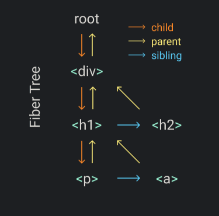

# 写一个自己的 React

```shell
# 安装依赖
yarn

# 本地开发
yarn start
```

[v1.basic](https://github.com/learn-by-do/build-your-react/tree/v1.basic) 版本的会阻塞主线程，当树比较大时，浏览器会处于假死状态，无法即时响应交互输入。因此我们需要将任务碎片化，当执行完一个碎片任务则释放线程，可以利用 `requestIdleCallback` 来实现（注意: React 已经不再使用这个 API，见 [issue#11171](https://github.com/facebook/react/issues/11171#issuecomment-417349573)，目前使用的是 [scheduler](https://github.com/facebook/react/tree/master/packages/scheduler)），这个 API 是当主线程空闲时激活回调函数。


## 如何划分任务

假设需要渲染这样一个树结构：

```js
React.render(
  <div>
    <h1>
      <p />
      <a />
    </h1>
    <h2 />
  </div>,
  container
)
```

它对应的 fiber 树如下图，每一个 fiber 有三个链，分别指向父、第一个子、下一个兄弟。



这种数据结构便于获取到下一个碎片任务。

当一个 fiber 的任务完成时，如果它有子，那么这个子就会是下一个碎片任务（如上例中的 `div` 结束后，下一个就是 `h1`，如果没有子，那么它的兄弟会是下一个碎片任务（上例中 `p` 结束后，下一个就是 `a`）。

体现在代码里：[performUnitOfWork](./src/render.js#L74)